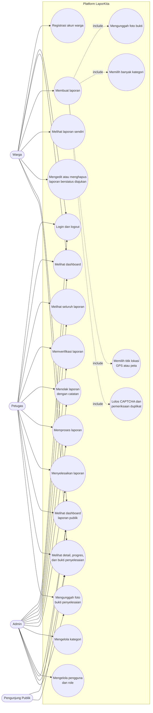
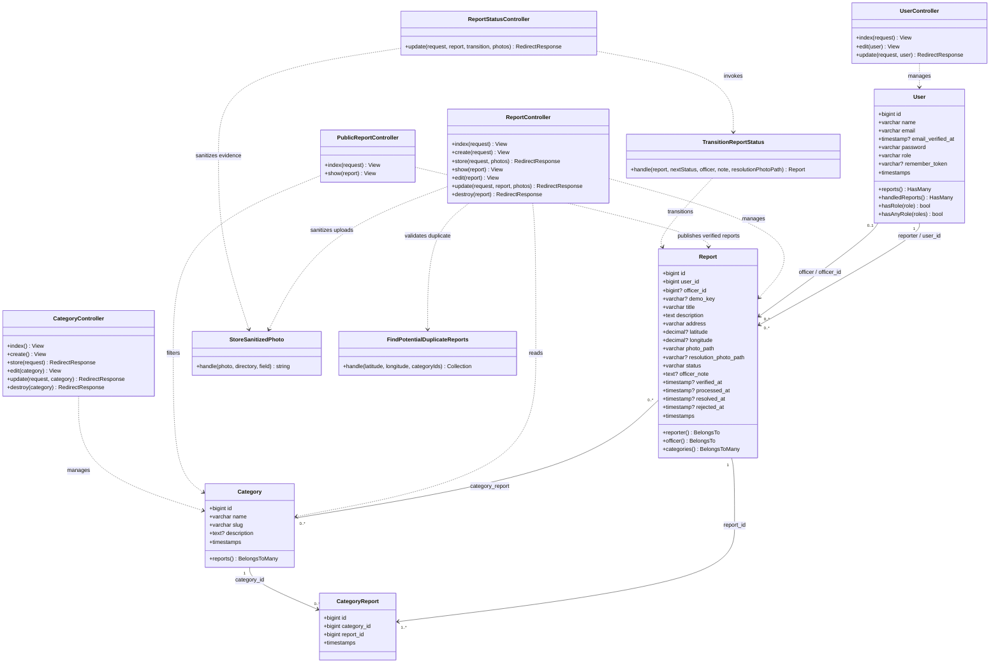
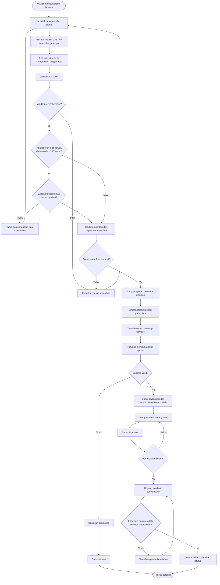
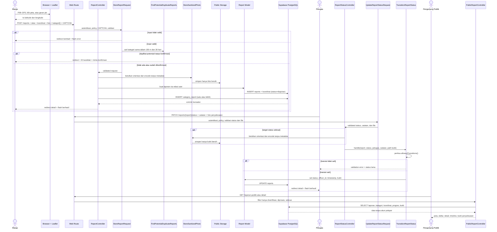
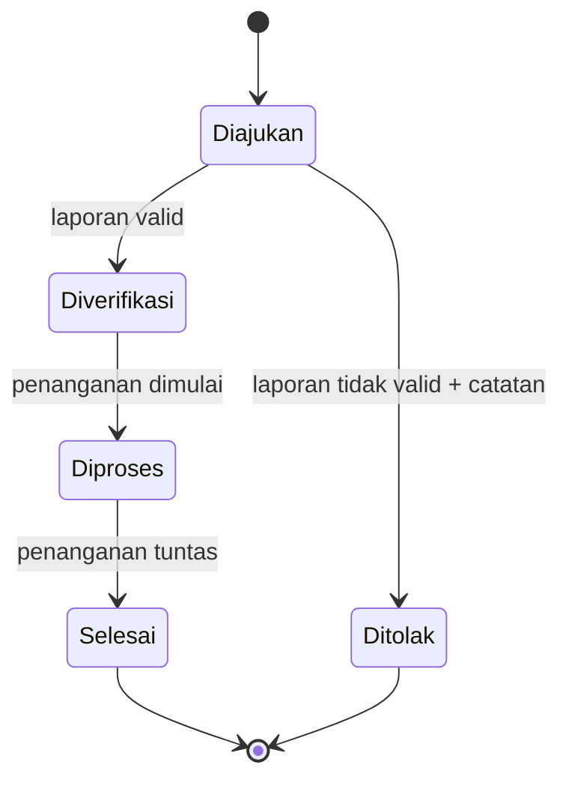

# Analisis dan Perancangan Sistem LaporKita

Dokumen ini adalah sumber UML yang harus tetap sinkron dengan migration dan kode
Laravel. Diagram menggunakan Mermaid dan dirender otomatis oleh GitHub.

## 1. Use Case Diagram

### Matriks hak akses

| Fitur | Publik | Warga | Petugas | Admin |
|---|:---:|:---:|:---:|:---:|
| Registrasi publik | Ya, menjadi warga | Ya, selalu role warga | Tidak | Tidak |
| Membuat laporan | Tidak | Ya, dengan peta dan CAPTCHA | Tidak | Tidak |
| Melihat dashboard publik | Ya | Ya | Ya | Ya |
| Melihat laporan internal | Tidak | Milik sendiri | Semua | Semua |
| Edit/hapus laporan | Tidak | Milik sendiri, hanya `diajukan` | Tidak | Tidak |
| Ubah status laporan | Tidak | Tidak | Ya | Ya |
| Unggah bukti penyelesaian | Tidak | Tidak | Ya | Ya |
| Kelola kategori | Tidak | Tidak | Tidak | Ya |
| Kelola pengguna/role | Tidak | Tidak | Tidak | Ya |

## 2. Class Diagram

### Kecocokan migration dan tabel domain

| Tabel | Kolom migration | Constraint/index |
|---|---|---|
| `users` | `id`, `name`, `email`, `email_verified_at`, `password`, `role`, `remember_token`, `created_at`, `updated_at` | PK `id`, unique `email`, index `role` |
| `reports` | `id`, `user_id`, `officer_id`, `title`, `description`, `address`, `latitude`, `longitude`, `photo_path`, `resolution_photo_path`, `demo_key`, `status`, `officer_note`, empat timestamp proses, Laravel timestamps | unique nullable demo_key (identitas seed), FK reporter cascade, FK officer null-on-delete, index status, pasangan user/status, officer/status, dan latitude/longitude |
| `categories` | `id`, `name`, `slug`, `description`, Laravel timestamps | PK `id`, unique `name`, unique `slug` |
| `category_report` | `id`, `category_id`, `report_id`, Laravel timestamps | Dua FK cascade dan unique pasangan kategori/laporan |

Tabel framework `migrations`, `password_reset_tokens`, `sessions`, `cache`, `cache_locks`,
`jobs`, `job_batches`, dan `failed_jobs` berasal dari migration bawaan Laravel.
Tabel tersebut mendukung autentikasi/sesi, cache, dan antrean, tetapi bukan entitas
domain pada relasi bisnis di atas.

## 3. Activity Diagram — Proses Laporan Utama

Aturan gagal utama: input atau CAPTCHA tidak valid kembali ke form dengan error;
kandidat duplikat perlu konfirmasi eksplisit; penolakan tanpa catatan gagal
validasi; penyelesaian tanpa foto bukti gagal; lompatan status seperti
`diajukan` langsung ke `selesai` ditolak oleh request dan
`TransitionReportStatus`.

## 4. Sequence Diagram — Membuat dan Memproses Laporan

## 5. State Diagram Status Laporan

Pemrosesan foto yang gagal mengembalikan validation error sebelum transaksi
laporan/status. Foto original tidak disimpan permanen. Penggantian foto memakai
action yang sama; file lama dihapus hanya setelah pembaruan database berhasil.
Tidak ada perubahan schema untuk pembersihan metadata.
